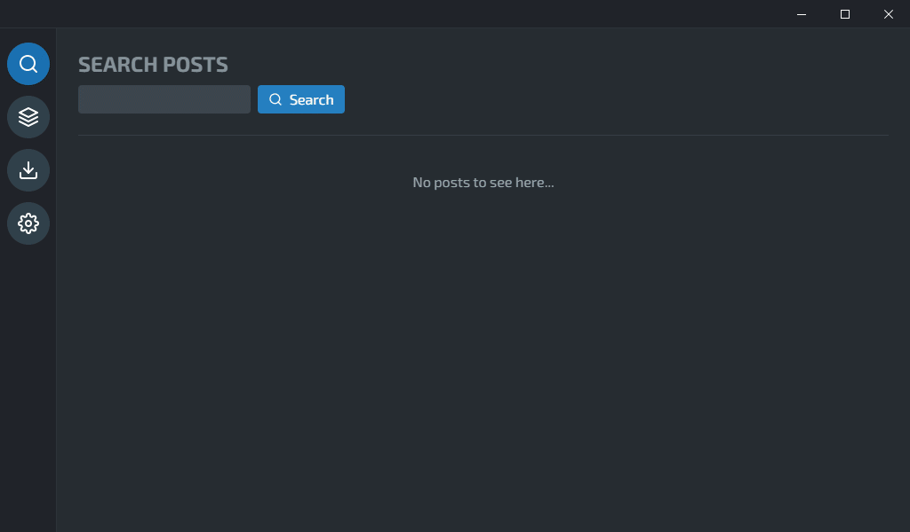

# e6Hub
[](https://ci.appveyor.com/project/Saektide/app)
[](https://deepscan.io/dashboard#view=project&tid=9325&pid=11662&bid=175184)

Wanna bring e621/e926 to your desktop? You got it, e6Hub is an app that allows you to fetch posts, pools and download them from [e621.net](https://e621.net/help/about) and e926. This app is powered by [Vue.js](https://vuejs.org/) and [Electron](https://www.electronjs.org/). Feel free to contribute to this project!

* [Download](https://github.com/e6Hub/app/releases/latest)
* [Changelog](https://github.com/e6Hub/app/blob/master/CHANGELOG.md#changelog)

## 🌟 Features
* Fetch, list (save temporally on your session) and download posts and pools
* SWF support (see [FAQ](#-faq) for how to enable it)
* Webm support
* Third party plugins support
* Blur explicit images
* DText support
* i18n support

## 📸 Showcase / Screenshot
<p align="center">
  
</p>

## 🌎 Translation status
| Language name | Progress | Translated by |
| ------------- | -------: | ------------: |
| English       | 100%     | Saektide      |
| Spanish       | 100%     | Saektide      |

## 🖥 Machine requirements
| Component | Minimum | Recommended |
| --------- | ------: | ----------: |
| RAM       | 2 GB    | 4 GB        |
| Storage   | ~150 MB | 250 MB      |
| CPU       |Any single core CPU | Any dual core CPU |
| Bandwidth Downstream | 1 MiB | 3 MiB |

## 🧪 OS Supported
> **Note** We release only 64 bits versions

| OS Name    | Status | Type |
| ---------- | :----: | ---: |
| Windows 7  |:heavy_exclamation_mark:     | .exe |
| Windows 8  |✔     | .exe |
| Windows 10 |✔     | .exe |
| Debian     |❌     | .deb |
| Fedora     |❌     | .rpm |
| Arch       |❌     | .tar |
| macOS      |⚠     | .dmg |

* ✔ Supported
* ❌ Not supported but can compile it
* ✖ Unstable
* ⚠ Not tested yet
* :heavy_exclamation_mark: Unstable since some version of Electron (mostly Electron 6 or 8)


## 💾 Install
### 💽 Clone
```
git clone https://github.com/e6Hub/app.git
cd app
```

### 📚 Install deps with NPM
```
npm i
```
or with Yarn
```
yarn
```

## 🛠 Compile
You can now start to write code. Once you done, compile it to make sure if it's work correctly.
```
yarn dev
```
or
```
npm run dev
```

## 📦 Build
It works? Great! now you can build it!
```
yarn build
```
or
```
npm run build
```

## ❓ FAQ

### Can i download multiple pools/posts at the same time?
You can download only one pool at the time. e6Hub will mark posts (and pools) as "pending" to avoid saturate e621's servers.

### Can i see blacklisted posts on this app?
No, e621's global blacklist works on server-side too. In a near future we may include Log In system but isn't necessary at this moment.

### e6Hub have telemetry?
No. And we wont include that feature on our app.

### I want to report a bug or give my feedback, where should i go?
Use the **Issues** section for bug report (if you are not sure if that's a bug or a feature you can ask on Discussions), for feedbacks you can use **Discussions** and Issues too.

### There's premium functions in this app?
No, all the app (and everything on there) is free and open source.

### How do i enable SWF on this app?
Assuming your machine have Windows (7 or greater), Adobe no longer support Flash right now but you still have the possibility to install it on your machine, since download page isn't available you have to find a file called `pepflashplayer.dll` for 64 bits online*. e6Hub will be able to play SWF posts if you have the proprietary Pepper Flash Player plugin installed and located at `C:\Windows\System32\Macromed\Flash`. If that didn't work, find a Flash Player installer somewhere online then verify if that installer is legit (check the signature).

\* For security reasons, **make sure DLL file have a digital signature** (Right click > Properties > Digital signatures) of "Adobe Inc." or "Adobe Systems Incorporated", must be signed with sha256 algorithm and the issuer should be **DigiCert**.

### I have questions that doesn't apply to the FAQ...
You can use **Discussions** and you will receive support from a experimental user or from a project contributor. We don't bite!
